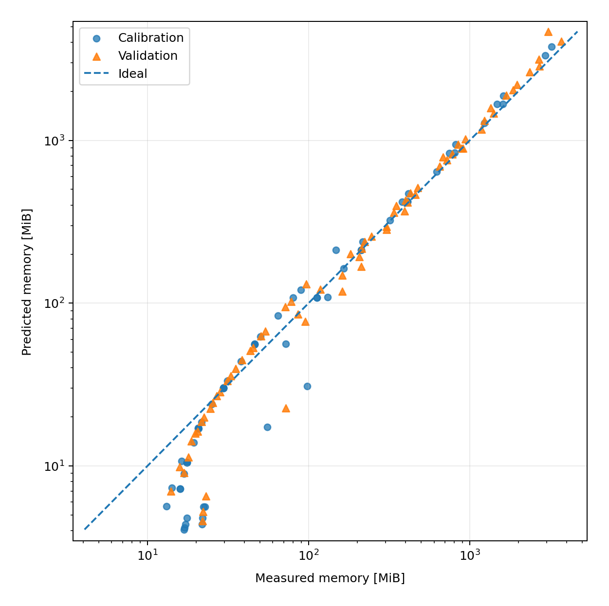
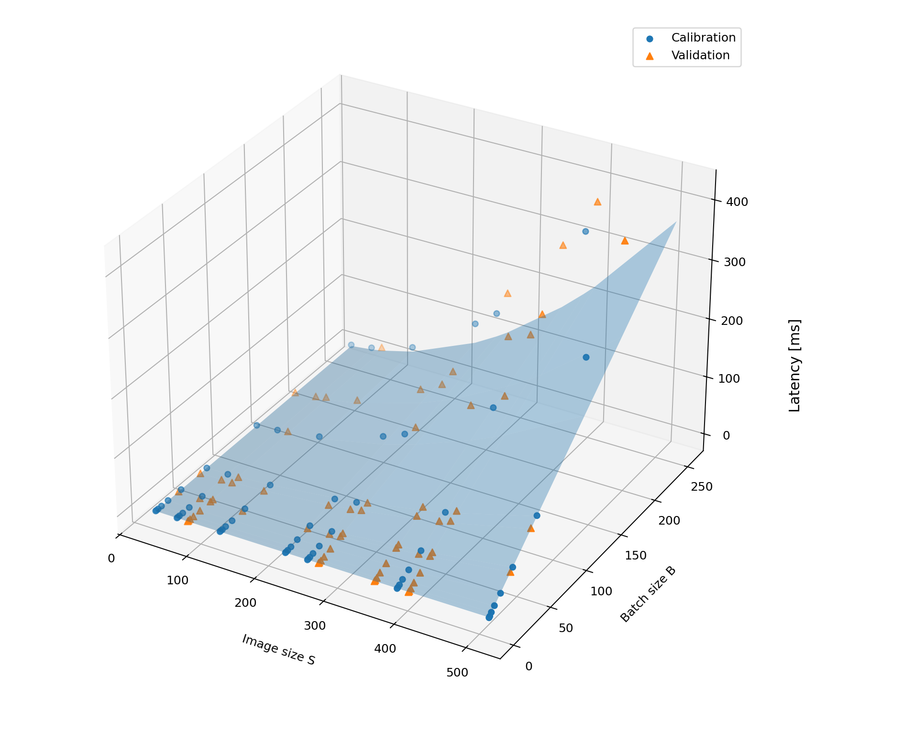
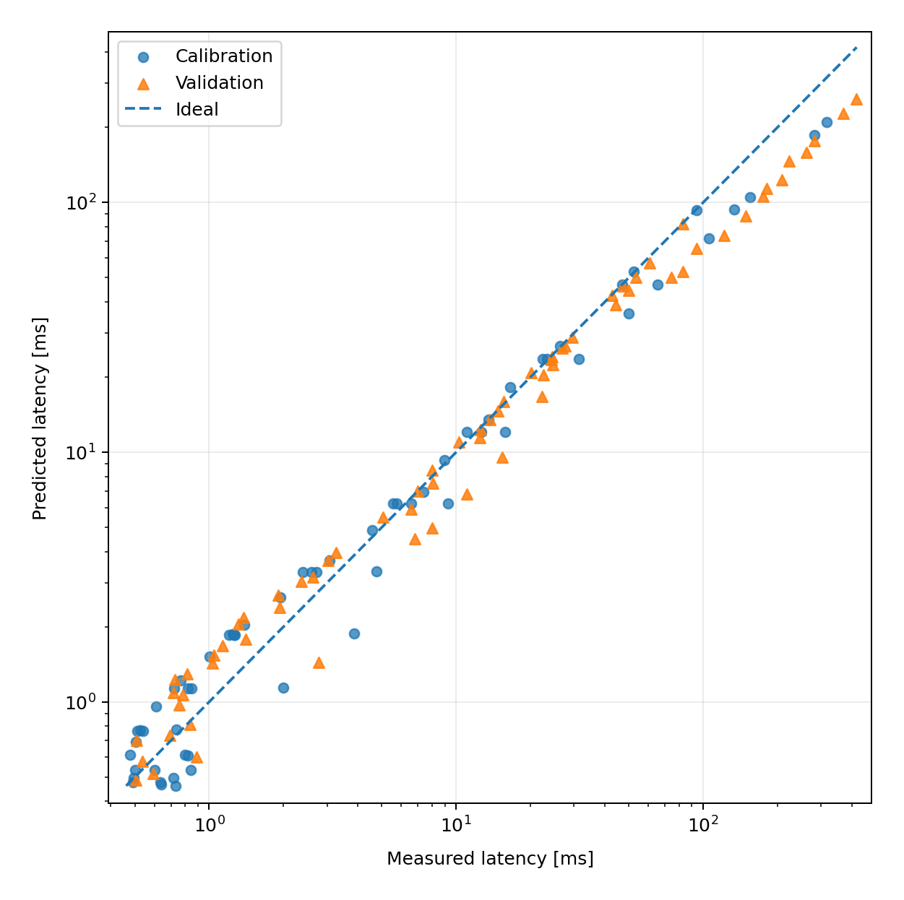
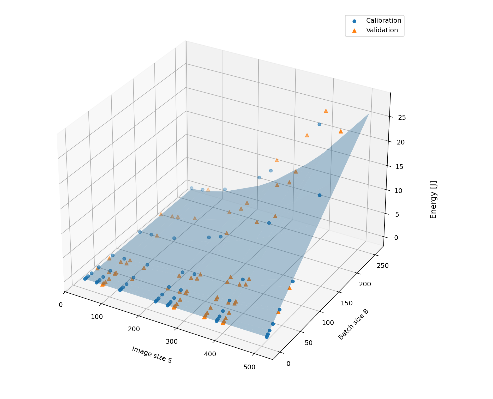
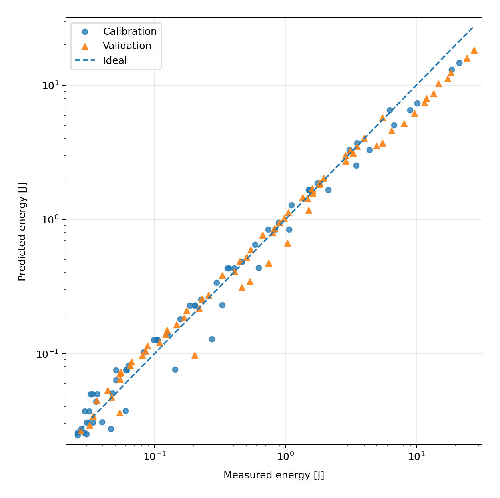
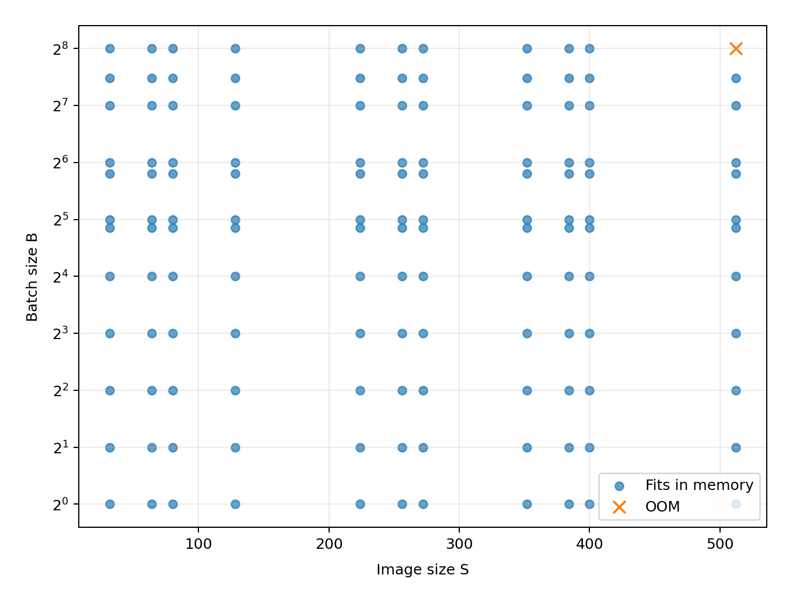

# Homework 1 — Analytical performance model of a small CNN

The goal of this homework is to build a simple analytical model for the cost of one forward pass of the CNN from the assignment and compare it with measurements on a real GPU.

The model predicts four quantities as functions of image size `S` and batch size `B`:

- FLOPs;
- peak GPU memory;
- latency;
- energy.

The full derivation is in `hw1_handwritten.pdf`. The implementation is split between `models.py`, `equations.py`, `measure.py` and `calibrate.py`.

## Hardware and software

Measurements were collected in Google Colab on a single NVIDIA Tesla T4.

- GPU: NVIDIA Tesla T4
- GPU memory: 15,637,086,208 bytes (~14.56 GiB)
- Python: 3.13
- NumPy: 2.1.3
- SciPy: 1.16.3
- pandas: 2.2.3
- Matplotlib: 3.10.0
- nvidia-ml-py: 13.610.43
- PyTorch: 2.11.0+cu128
- CUDA used by PyTorch: 12.8

All measurements use FP32, `model.eval()` and `torch.inference_mode()`. TF32 is disabled and `torch.backends.cudnn.benchmark` is set to `False`.

To obtain at least one OOM point on the prescribed grid, the PyTorch process memory limit was set to 28% of total GPU memory using `torch.cuda.set_per_process_memory_fraction`. This corresponds to about 4.08 GiB.

## Analytical model

The implemented network contains 1,039,968 trainable parameters. Convolutions and linear layers are bias-free. BatchNorm is not used. ReLU is applied after each convolution and is in-place.

For FLOPs I count Conv and Linear MACs only, with `1 MAC = 2 FLOPs`:

\[
F(S,B) = B(17712S^2 + 313344).
\]

For the analytical memory estimate I follow the convention used for this homework: model weights plus the sum of all activation tensors:

\[
M(S,B) = 4[1039968 + B(26S^2 + 868)]
\]

bytes.

For memory traffic I assume that Conv/Linear read their input and weights once and write their output once, ReLU reads and writes the activation, and pooling reads its input and writes its output. Cache reuse is not modeled:

\[
Q(S,B) = 4[1039968 + B(91S^2 + 2148)]
\]

bytes.

Latency is modeled with a small roofline-like expression:

\[
T(S,B) = t_0 + \max\left(\frac{F(S,B)}{P}, \frac{Q(S,B)}{BW}\right).
\]

The fitted parameters are:

- \(t_0 = 0.402\) ms;
- \(P = 3.193 \times 10^{12}\) FLOP/s;
- \(BW = 7.707 \times 10^{10}\) byte/s.

Energy is modeled as

\[
E(S,B) = e_0 + e_F F_{\mathrm{GFLOP}} + e_Q Q_{\mathrm{GB}}.
\]

The fitted parameters are:

- \(e_0 = 0.01978\) J;
- \(e_F = 1.24 \times 10^{-8}\) J/GFLOP;
- \(e_Q = 1.0711\) J/GB.

The energy parameters are fitted in log-space because the measured values span several orders of magnitude.

## Measurement grid

The base grid from the assignment is

- `S = [32, 64, 128, 224, 256, 384, 512]`;
- `B = [1, 2, 4, 8, 16, 32, 64, 128, 256]`.

With random seed 42, the additional values were

- `S = [80, 272, 352, 400]`;
- `B = [29, 56, 179]`.

This gives 11 image sizes × 12 batch sizes = 132 configurations.

The 63 base-grid configurations are marked as calibration points. Any configuration containing an additional random `S` or `B` is marked as validation, giving 69 validation points. The configuration `(S=512, B=256)` produced OOM under the imposed memory limit.

## Results

| Metric | Calibration MAPE | Calibration R² | Validation MAPE | Validation R² |
|---|---:|---:|---:|---:|
| Memory | 27.52% | 0.9772 | 17.18% | 0.9291 |
| Latency | 26.04% | 0.8785 | 23.41% | 0.8167 |
| Energy | 20.43% | 0.9034 | 17.04% | 0.8539 |

The main prediction surfaces are shown below.

### Memory




### Latency





### Energy





### OOM



## Discussion

The analytical formulas capture the overall scaling with `S` and `B`, but the real GPU does not behave like a single ideal compute unit with constant throughput and bandwidth.

For small configurations, the fixed latency term is important. The fitted launch/fixed overhead is about 0.4 ms, while the estimated compute and memory times for the smallest inputs are much smaller. These configurations are therefore mostly launch-bound. As the workload grows, memory traffic becomes relevant, and for larger configurations the compute term becomes dominant. The simple `max(F/P, Q/BW)` model reproduces this transition reasonably well, but it cannot model all shape-dependent effects of cuDNN kernel selection and GPU utilization. This is visible in the latency parity/error plots: the model tends to underestimate some of the largest measured latencies.

The analytical memory formula behaves differently from the real PyTorch peak by construction. It sums all activations as required for the analytical estimate, while `torch.cuda.max_memory_allocated()` measures allocations that are actually alive at the same time. PyTorch can reuse or release intermediate buffers, while cuDNN can also request additional workspaces. This explains why the model can overestimate memory for large tensors but underestimate it for small configurations where fixed framework/workspace allocations are relatively important. With the 28% process memory limit, only `(512, 256)` produced an actual OOM.

Energy follows the workload quite well, but the fitted decomposition between FLOPs and bytes moved should not be interpreted as a direct physical measurement of energy per arithmetic operation or per DRAM byte. For this fixed CNN, FLOPs and estimated memory traffic scale almost proportionally over the `(S, B)` grid, so the two coefficients are poorly identifiable from these experiments alone. The fitted model is still useful as a predictive approximation: validation MAPE is about 17%.

Overall, the simple analytical model is sufficient to recover the main scaling trends and to identify the launch-bound, memory/traffic-sensitive and compute-dominated regions. The remaining errors mainly come from assumptions that are deliberately simplified: constant effective throughput/bandwidth, no cache model, simplified memory traffic, framework allocations, and kernel-selection effects.

## Reproduction

Install the required packages:

```bash
pip install nvidia-ml-py scipy pandas matplotlib
```

Check the runtime versions:

```bash
python -c "import sys, torch; print(sys.version); print('torch', torch.__version__); print('cuda', torch.version.cuda)"
```

Run a quick model check:

```bash
python models.py
```

Expected output includes:

```text
torch.Size([2, 100])
1039968
```

Run the measurements:

```bash
CUDA_MEMORY_FRACTION=0.28 python measure.py
```

Then fit the calibrated parameters and regenerate all figures:

```bash
python calibrate.py
```

The generated artifacts are stored in `results/`:

```text
results/
├── measurements.csv
├── theta.json
└── figures/
```

`measurements.csv` contains measured and predicted values together with the calibration/validation flag and OOM status. `theta.json` contains the fitted latency and energy parameters.
